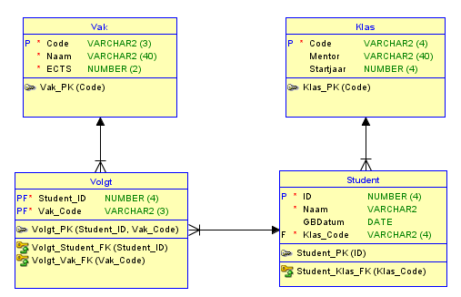

# DP herkansing
Er is geen koppeltabel meer als entity, DAO en DAOimpl.<br />
Er wordt gebruik gemaakt van joins en inner join om de data doormiddel van de koppeltabel op te halen. <br />

## Relaties 
De uitwerking van de relaties binnen de applicatie: <br>
Een Klas kan één of meerdere Studenten hebben. <br />
Een Student zit in één Klas <br />
Een Student volgt één of meerdere Vakken <br />
Een Vak wordt gevolgd door één of meerdere Studenten <br />



## Runners
```
De p1,p2,p3 opdrachten Combined in Package(DAO, DAOimpl, Entitys)
Als runner: BaseApp.main
De P4/5 Hibernate combined in Package(hibernate)
Als runner JPAApp.main
```